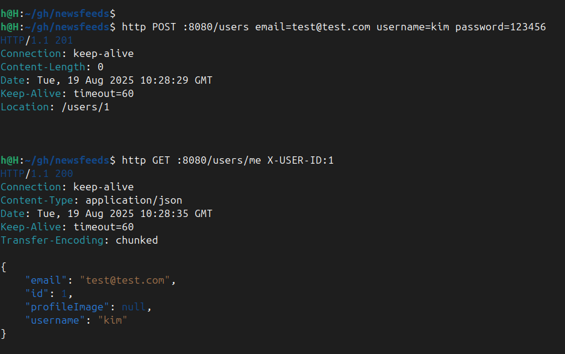
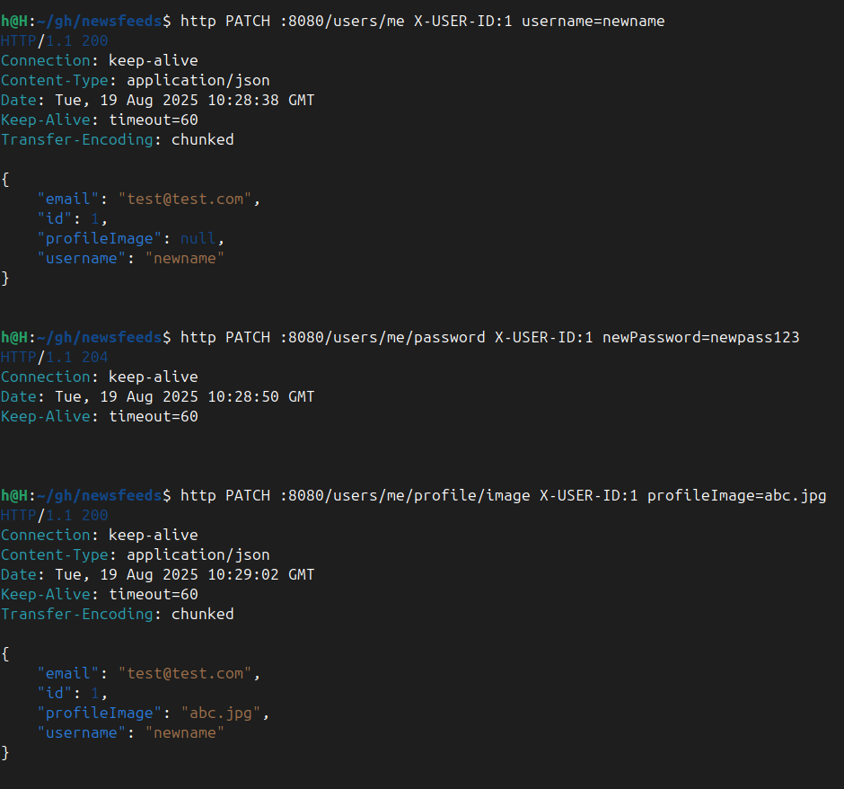
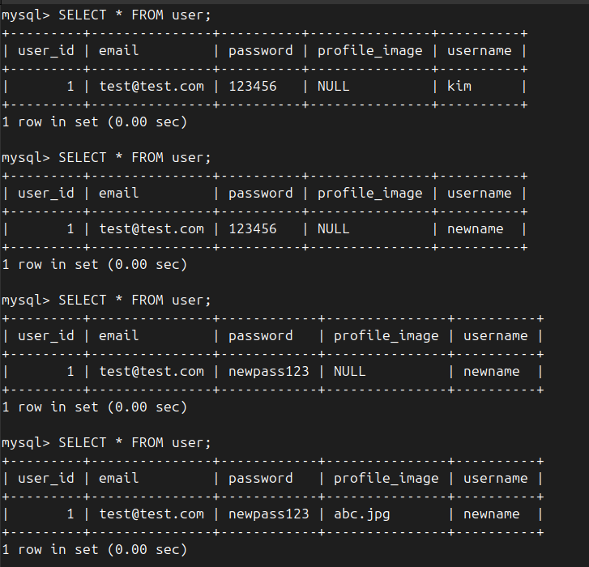

## User_tbl

```
user_id (PK) : AUTO_INCREMENT
email        : varchar(20), NOT NULL, UNIQUE
username     : varchar(15), NOT NULL
password     : varchar(60), NOT NULL
profileImage : varchar(100)
```

---

## ENDPOINTS

### 자기 정보 조회
- **GET /users/me**
- 헤더: `X-USER-ID: {userId}`
- 응답 200
```json
{
  "id": 1,
  "email": "test@test.com",
  "username": "kim",
  "profileImage": null
}
````

* 응답 404: 존재하지 않는 사용자

---

### 자기 정보 수정 (username)

* **PATCH /users/me**
* 헤더: `X-USER-ID: {userId}`
* 요청

```json
{
  "username": "newname"
}
```

* 응답 200

```json
{
  "id": 1,
  "email": "test@test.com",
  "username": "newname",
  "profileImage": null
}
```

* 응답 404: 존재하지 않는 사용자

---

### 비밀번호 변경

* **PATCH /users/me/password**
* 헤더: `X-USER-ID: {userId}`
* 요청

```json
{
  "newPassword": "newpass123"
}
```

* 응답 204: 성공 (No Content)
* 응답 404: 존재하지 않는 사용자

---

### 프로필 이미지 변경

* **PATCH /users/me/profile/image**
* 헤더: `X-USER-ID: {userId}`
* 요청

```json
{
  "profileImage": "abc.jpg"
}
```

* 응답 200

```json
{
  "id": 1,
  "email": "test@test.com",
  "username": "kim",
  "profileImage": "abc.jpg"
}
```

* 응답 404: 존재하지 않는 사용자

---

## API Summary

| Method | Endpoint                  | Header    | Body Example                      | Success  | Fail |
| ------ | ------------------------- | --------- | --------------------------------- | -------- | ---- |
| GET    | `/users/me`               | X-USER-ID | -                                 | 200 JSON | 404  |
| PATCH  | `/users/me`               | X-USER-ID | `{ "username": "newname" }`       | 200 JSON | 404  |
| PATCH  | `/users/me/password`      | X-USER-ID | `{ "newPassword": "newpass123" }` | 204      | 404  |
| PATCH  | `/users/me/profile/image` | X-USER-ID | `{ "profileImage": "abc.jpg" }`   | 200 JSON | 404  |

---

## 참고

### X-USER-ID 헤더
현재는 로그인/세션/토큰 기반 인증을 구현하지 않았기 때문에, **임시로 로그인한 사용자 id를 흉내내기 위한 헤더**를 사용한다.  
`X-USER-ID: 1` 과 같이 요청 헤더에 값을 넣으면 컨트롤러에서 해당 값을 `@RequestHeader("X-USER-ID") Long userId` 로 받아 DB 조회에 활용한다.  
→ 추후 JWT 또는 세션 인증으로 대체될 예정.

### record
Java 16에서 정식 도입된 간결한 데이터 전달용 클래스.  
- 불변(immutable) 데이터 객체를 만들 때 사용.  
- DTO 작성 시 `getter`, `equals`, `hashCode`, `toString` 등을 자동 생성해줘서 코드가 짧아진다.  

예시:
```java
public record CreateUserRequest(String email, String username, String password) {}
```

* 인증/인가 로직은 생략하고, 임시로 `X-USER-ID` 헤더를 사용해 로그인 사용자를 흉내냄.

---

## 캡쳐



