# Newsfeed API 시스템 구조

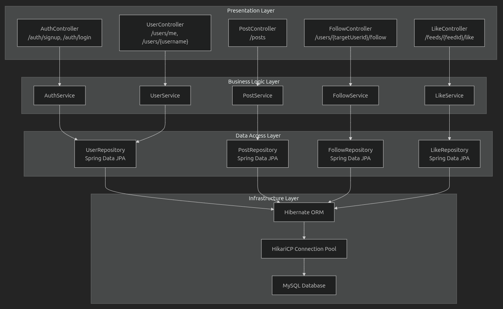

---

# API 엔드포인트

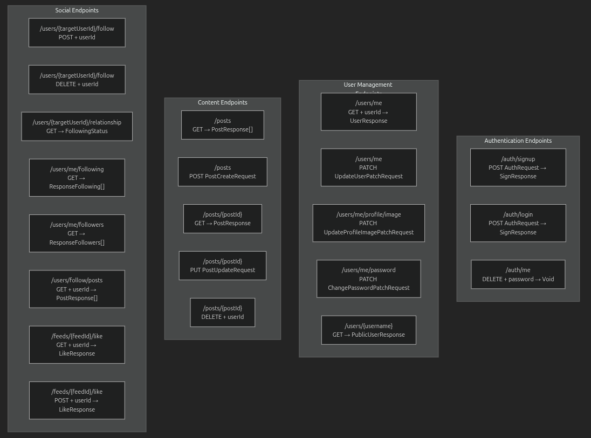

---

# ERD

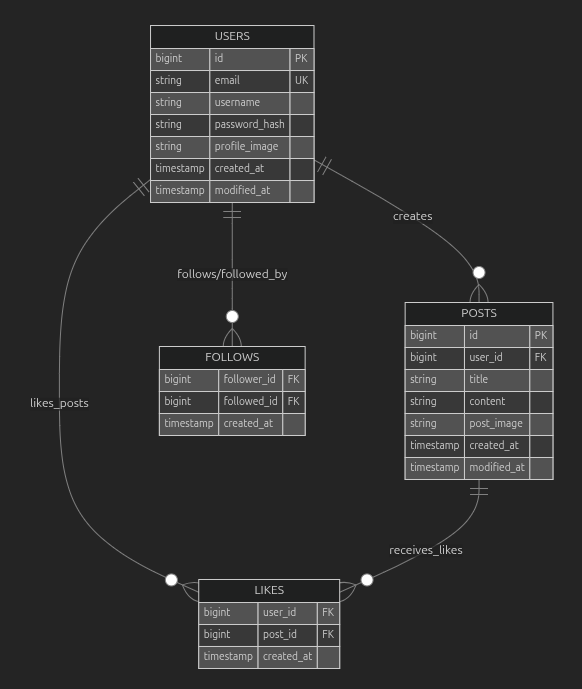

---

# 요청, 응답 구조

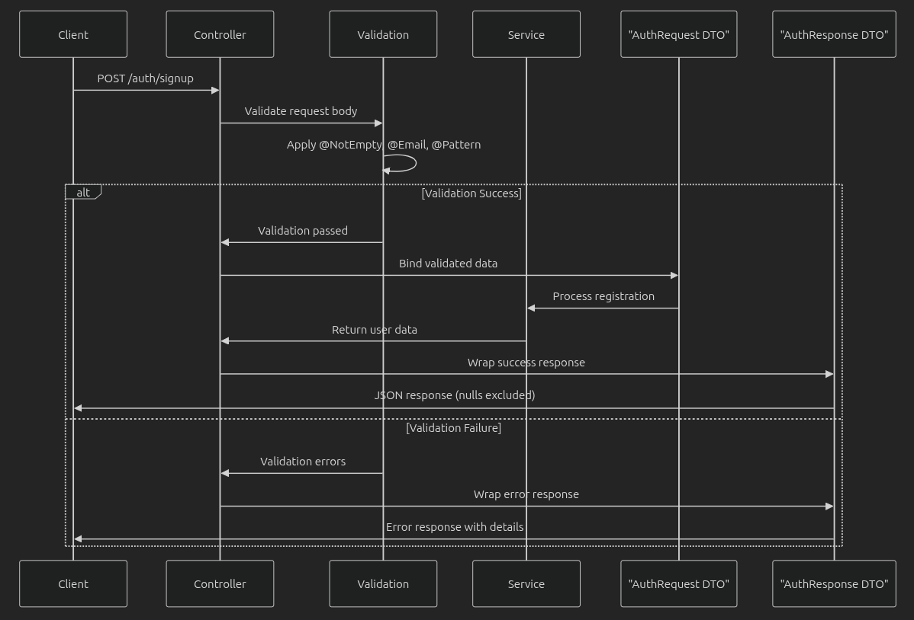

---

# 데이터베이스 전달 구조

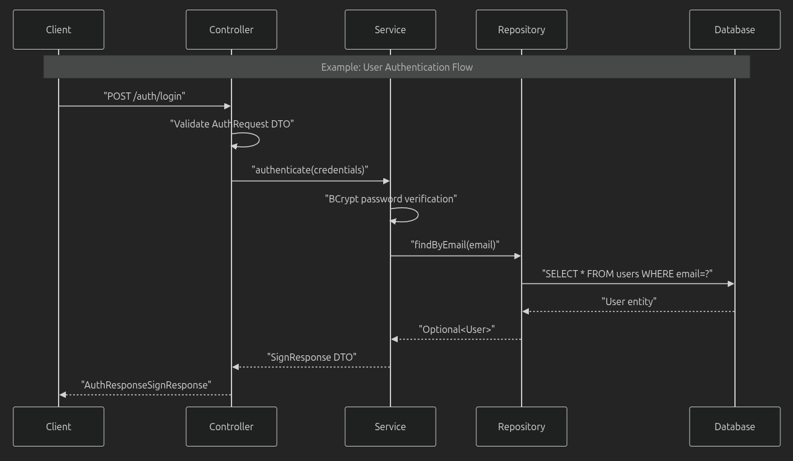

---

# 인증 API

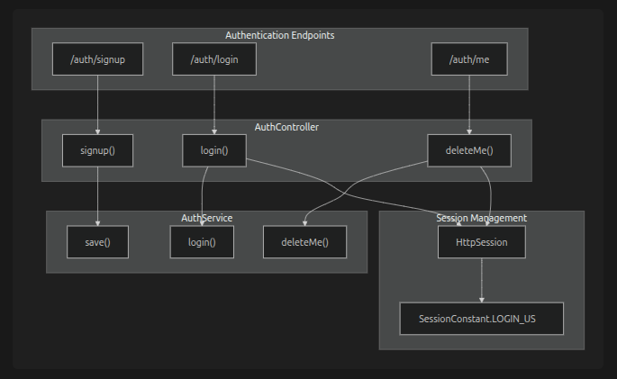

---

# 등록 (Signup)

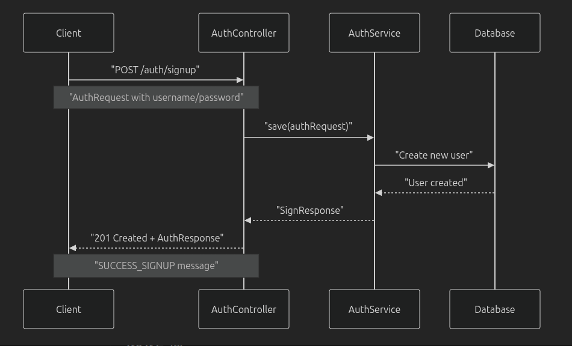

### POST /auth/signup
- 새 사용자 계정 생성
- 본문: `application/json`
- 응답: `201 Created`

---

# 로그인 (Login)

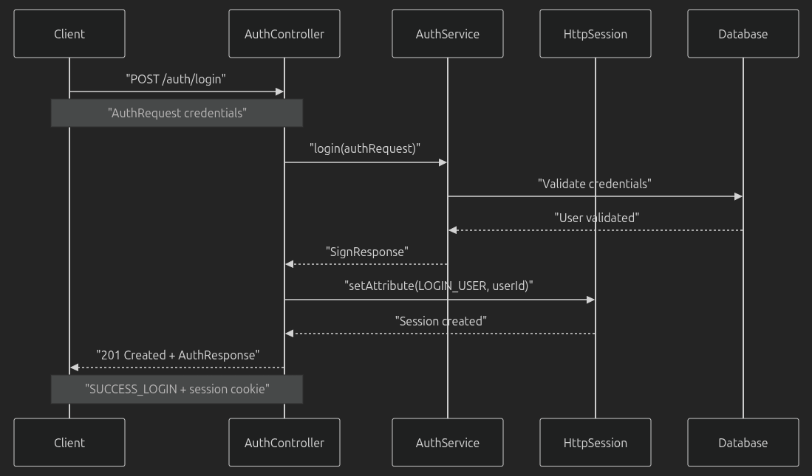

### POST /auth/login
- 사용자 인증, 세션 생성
- 성공 시: `201 Created`

---

# 탈퇴 (Delete)

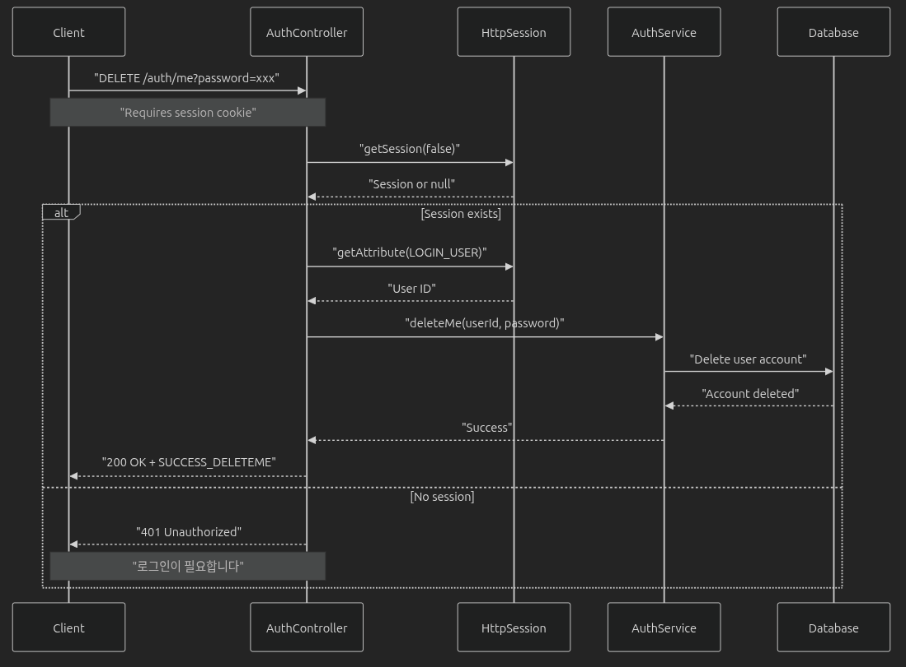

### DELETE /auth/me
- 세션 검증 후 계정 삭제
- 성공 시: `200 OK`

---

# 사용자 API

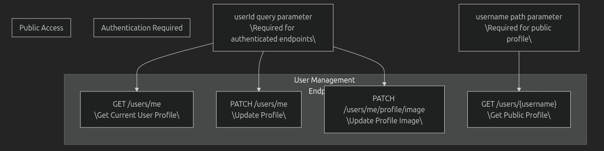

---

# 사용자 관계도

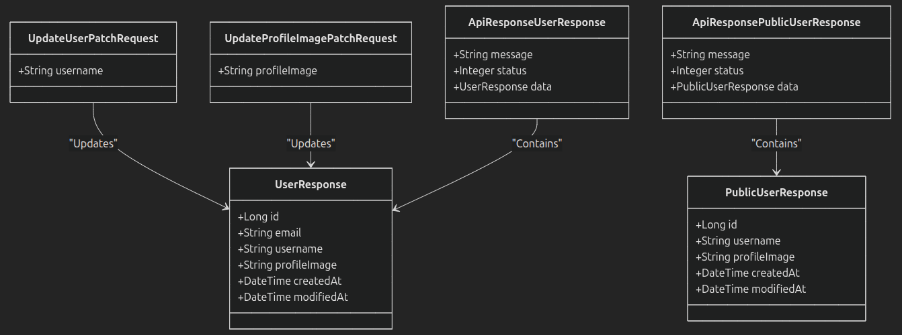

---

# 사용자 구조

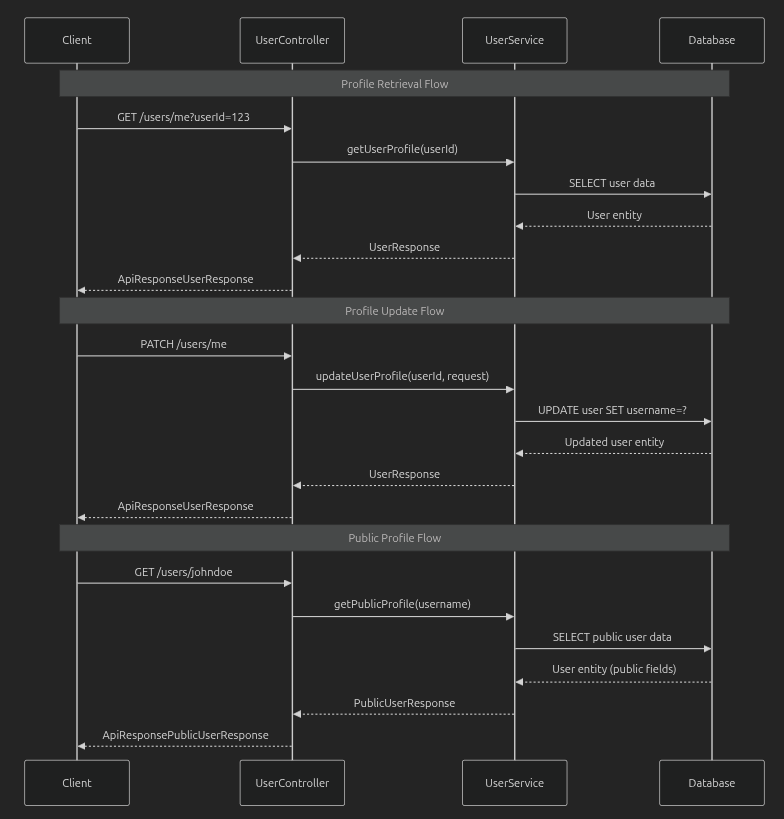

---

# 게시물 API

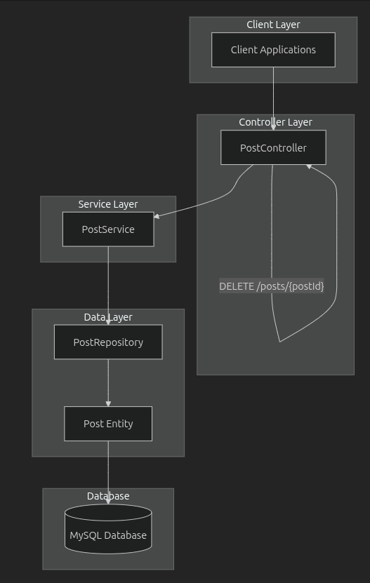

---

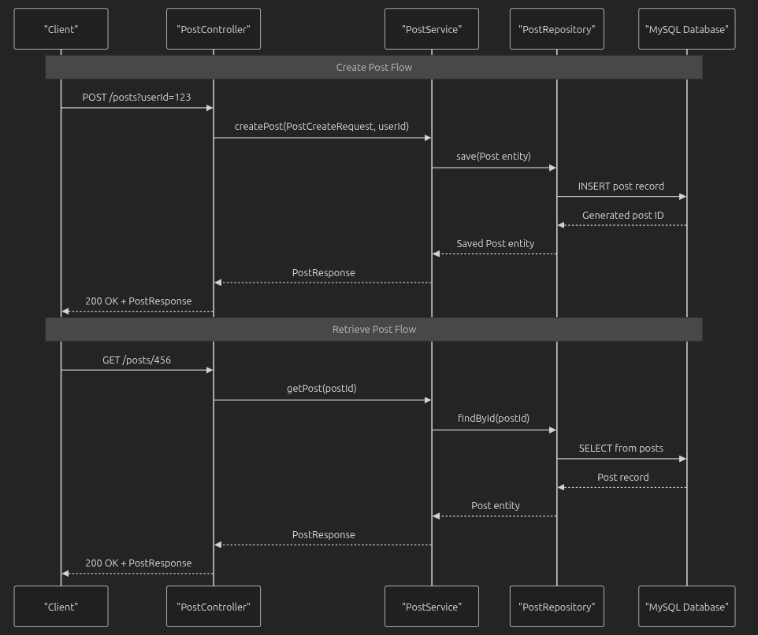

---

# 게시물 엔드포인트 요약

| 방법 | 엔드포인트 | 설명 | 인증 필요 |
|------|-------------|------|-----------|
| GET  | `/posts` | 모든 게시물 검색 | 아니요 |
| POST | `/posts` | 게시물 생성 | 네 |
| GET  | `/posts/{id}` | 특정 게시물 검색 | 아니요 |
| PUT  | `/posts/{id}` | 게시물 수정 | 네 |
| DELETE | `/posts/{id}` | 게시물 삭제 | 네 |

---

# 소셜 기능 API

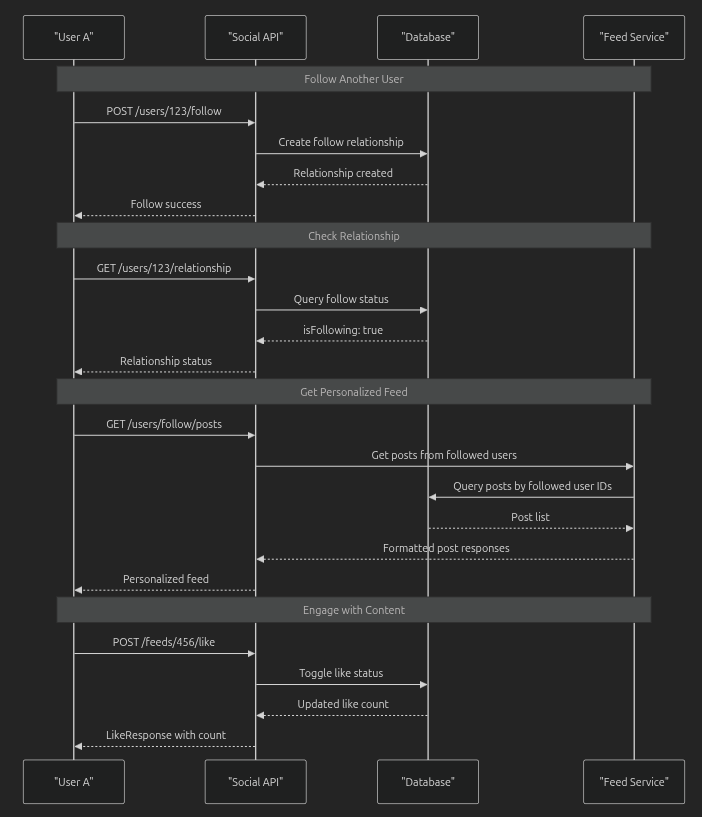

---

# 소셜 컨트롤러

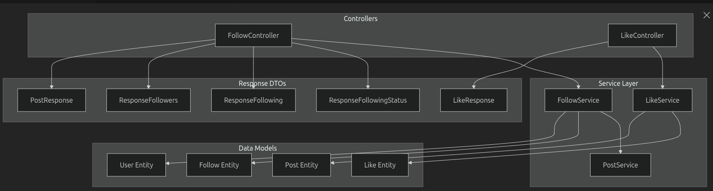

---

# 팔로우/언팔로우

| 엔드포인트 | 방법 | 설명 |
|-------------|------|------|
| `/users/{id}/follow` | POST | 팔로우 |
| `/users/{id}/follow` | DELETE | 언팔로우 |
| `/users/{id}/relationship` | GET | 관계 확인 |

---

# 팔로워 / 팔로잉

- `/users/me/following` → 내가 팔로우하는 목록
- `/users/me/followers` → 나를 팔로우하는 목록

---

# 좋아요 기능

| 엔드포인트 | 방법 | 설명 |
|-------------|------|------|
| `/feeds/{id}/like` | GET | 좋아요 수 조회 |
| `/feeds/{id}/like` | POST | 좋아요 토글 |

---

# 좋아요 응답 구조

```json
{
  "liked": true,
  "likeCount": 42
}
```

---

# 스프링 구성

| 모듈 | 주요 클래스 | 목적 |
|------|-------------|------|
| `spring-boot-starter-web` | `@RestController` | REST API |
| `spring-boot-starter-data-jpa` | `JpaRepository` | ORM |
| `spring-boot-starter-security` | `@EnableWebSecurity` | 인증/권한 |

---

# 영속성 구성

| 요소 | 버전 | 목적 |
|------|------|------|
| Hibernate | 6.6.22 | ORM |
| HikariCP | 6.3.1 | 커넥션 풀 |
| MySQL Connector/J | 9.3.0 | DB 드라이버 |

---

# 보안 구성

| 요소 | 특징 |
|------|------|
| Spring Security 6.2.9 | 인증, 권한, CSRF |
| BCrypt 0.10.2 | 비밀번호 해싱 |
